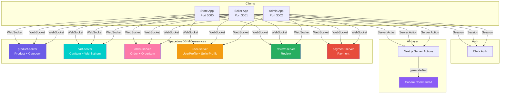
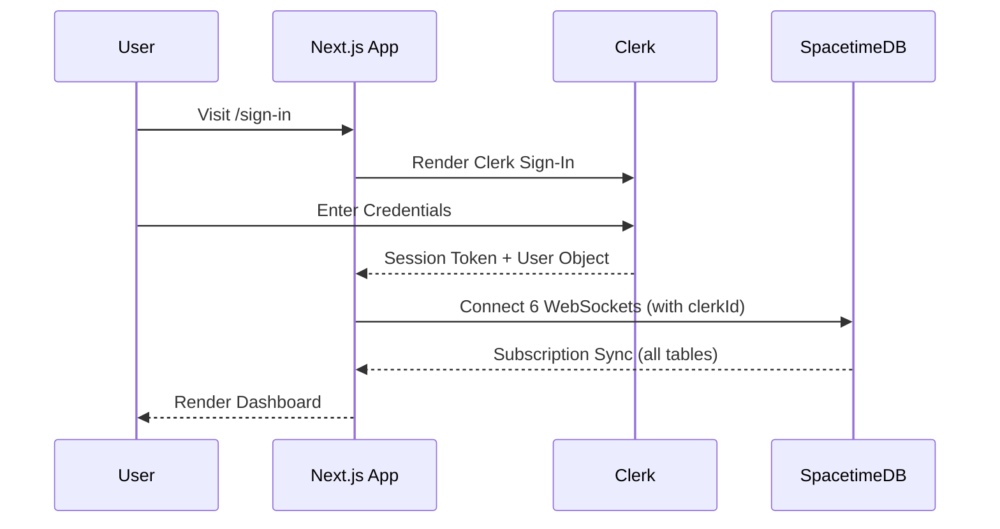
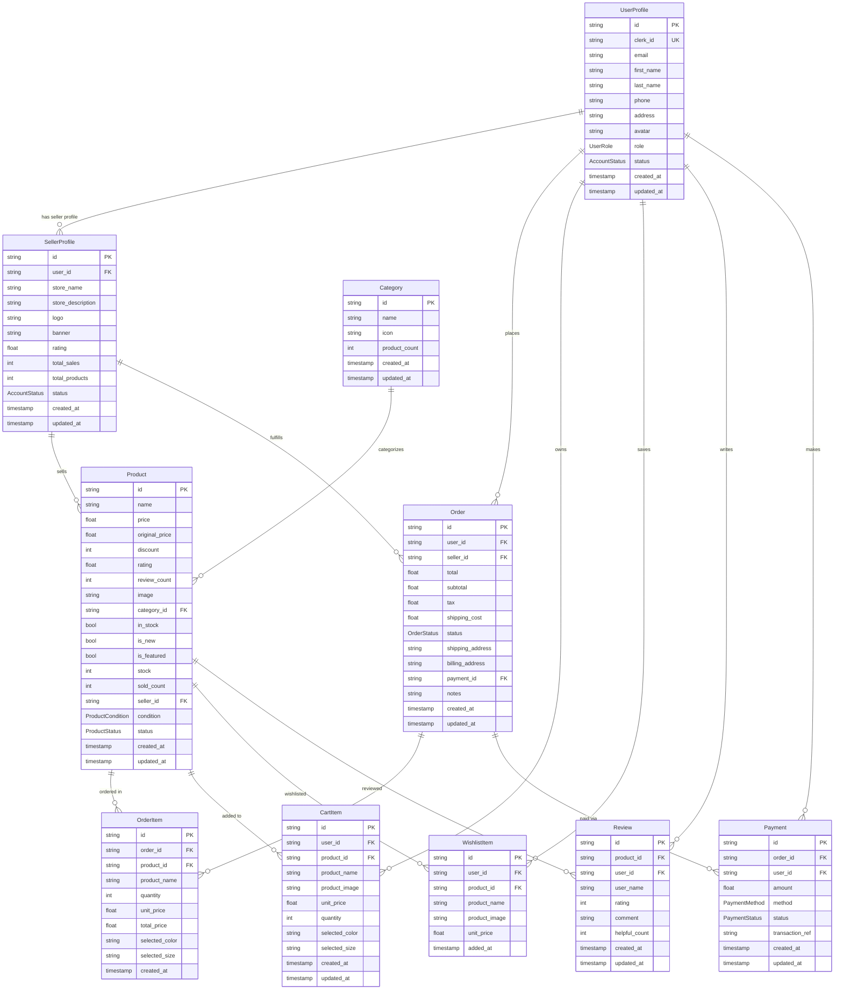
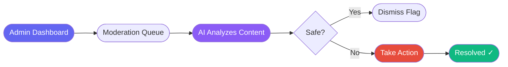

<h1 align="center">Neuro Cart | AI-Powered E-Commerce Platform</h1>

<p align="center">
  <strong>Microservices E-Commerce with Real-Time Sync, AI Content Intelligence, and Multi-Dashboard Architecture</strong>
</p>

<p align="center">
  
  
  
  
  
  
  
  
  
  
  <a href="https://creativecommons.org/licenses/by-nc/4.0/">
    
  </a>
</p>

## Overview

Neuro Cart is a production-grade e-commerce platform built as a Turborepo monorepo. It features three independent Next.js 16 dashboards, **Store** (customer-facing), **Seller** (merchant portal), and **Admin** (platform operations), backed by six Rust-based SpacetimeDB microservices. AI capabilities for content moderation, product generation, fraud detection, and intelligent search are powered by Cohere's Command A model via the Vercel AI SDK through Next.js Server Actions.

Every data mutation flows through SpacetimeDB WASM reducers over WebSockets. There are zero REST endpoints, zero HTTP round-trips for CRUD. Clients subscribe to table changes and receive real-time delta pushes, the UI stays synchronized across all connected dashboards instantly.

## Monorepo Structure

```
neuro-cart/
├── apps/
│   ├── store/          → Customer storefront (Next.js, port 3000)
│   ├── seller/         → Merchant dashboard (Next.js, port 3001)
│   └── admin/          → Platform admin panel (Next.js, port 3002)
├── servers/
│   ├── product-server/ → Product catalog + categories (Rust/WASM)
│   ├── cart-server/    → Cart items + wishlists (Rust/WASM)
│   ├── order-server/   → Orders + order items (Rust/WASM)
│   ├── user-server/    → User profiles + seller profiles (Rust/WASM)
│   ├── review-server/  → Product reviews + ratings (Rust/WASM)
│   └── payment-server/ → Payment processing (Rust/WASM)
├── packages/
│   ├── ui/             → Shared React component library (Button, Input, Select)
│   ├── shared/         → Hooks, providers, SpacetimeDB bindings, types
│   ├── eslint-config/  → Shared ESLint configuration
│   └── typescript-config/ → Shared TSConfig presets
├── turbo.json          → Turborepo pipeline config
└── pnpm-workspace.yaml → Workspace definition
```

## Architecture

### Why SpacetimeDB Over REST

Traditional e-commerce backends use REST APIs with PostgreSQL. Every read is a round-trip. Every write is a round-trip. Real-time features require bolting on a separate WebSocket layer. Neuro Cart eliminates all of this.

SpacetimeDB compiles Rust structs into WASM modules. Clients connect over a single WebSocket, call reducers (the equivalent of API endpoints), and receive table-change deltas pushed automatically. The data model, business logic, and real-time sync are a single artifact.

| Aspect         | REST + PostgreSQL         | SpacetimeDB                     |
| :------------- | :------------------------ | :------------------------------ |
| Read latency   | HTTP round-trip per query | In-memory table iteration       |
| Write latency  | HTTP + SQL transaction    | WASM reducer execution          |
| Real-time sync | Separate WebSocket layer  | Built-in subscription push      |
| Backend code   | Express/Fastify + ORM     | Rust struct + reducer functions |
| Deployment     | API server + DB server    | Single WASM module publish      |

### Data Synchronization Flow

```mermaid
sequenceDiagram
    participant C as Next.js Client
    participant WS as WebSocket
    participant W as WASM Reducer
    participant T as In-Memory Tables

    rect rgb(15, 42, 30)
    Note over C: User Action
    C->>WS: Call Reducer (e.g. addToCart)
    WS->>W: Execute WASM Logic
    W->>T: Mutate In-Memory State
    T-->>WS: Broadcast Delta to All Subscribers
    WS-->>C: onUpdate Callback → React Re-render
    Note over C: UI Updated Instantly
    end
```



### Microservices Architecture



### AI Server Actions Architecture

```mermaid
sequenceDiagram
    participant UC as Client Component
    participant SA as Next.js Server Action
    participant AI as Cohere Command A

    rect rgb(30, 15, 42)
    Note over UC: Store App
    UC->>SA: searchProducts(query)
    SA->>AI: generateText(search prompt)
    AI-->>SA: JSON suggestions array
    SA-->>UC: Parsed search results
    end

    rect rgb(15, 30, 42)
    Note over UC: Seller App
    UC->>SA: generateProductDescription(name, category, keywords)
    SA->>AI: generateText(description prompt)
    AI-->>SA: Product copy text
    SA-->>UC: AI-written description
    end

    rect rgb(42, 15, 30)
    Note over UC: Admin App
    UC->>SA: analyzeContent(content, contentType)
    SA->>AI: generateText(moderation prompt)
    AI-->>SA: JSON safety analysis
    SA-->>UC: Moderation result with flags
    end
```



### Authentication Flow



## Database Schema



## AI Capabilities

All AI features use real Cohere Command A model calls via Next.js Server Actions (`"use server"`).

### Store AI

| Action          | Function                                | Description                                             |
| :-------------- | :-------------------------------------- | :------------------------------------------------------ |
| Smart Search    | `searchProducts(query)`                 | Natural language product search with category inference |
| Recommendations | `getRecommendations(product, category)` | AI-generated related product suggestions                |
| Summarization   | `generateProductSummary(description)`   | Concise listing summaries from long descriptions        |

### Seller AI

| Action          | Function                                               | Description                               |
| :-------------- | :----------------------------------------------------- | :---------------------------------------- |
| Copy Generation | `generateProductDescription(name, category, keywords)` | AI-written product listings               |
| Tag Generation  | `generateProductTags(name, description)`               | SEO-optimized product tags                |
| Sales Analysis  | `analyzeSalesData(salesSummary)`                       | Business intelligence from sales patterns |

### Admin AI

| Action             | Function                               | Description                            |
| :----------------- | :------------------------------------- | :------------------------------------- |
| Content Moderation | `analyzeContent(content, contentType)` | Automated policy violation detection   |
| Platform Insights  | `generatePlatformInsights(metrics)`    | AI-driven analytics from platform data |
| Fraud Detection    | `detectFraud(transactionData)`         | Risk scoring for transaction patterns  |

## User Flows

### Customer Purchase Flow


### Seller Product Listing


### Admin Moderation Flow



## Features by Dashboard

### Store (Customer)

- Product catalog with search, filtering, categories
- AI-powered product search and recommendations
- Shopping cart with quantity management
- Wishlist for saved items
- Full checkout flow with payment
- Order history and cancellation
- Product reviews and ratings
- User account management with Clerk
- Dark/light theme toggle
- Arabic/English i18n with RTL support

### Seller (Merchant)

- Sales dashboard with revenue metrics
- Product management (create, edit, stock)
- AI-generated product descriptions and tags
- Order fulfillment tracking
- Sales analytics with AI insights
- Store profile and settings
- Dark/light theme toggle
- Arabic/English i18n with RTL support

### Admin (Platform)

- Platform-wide analytics (GMV, orders, users)
- Revenue and category distribution charts
- User and seller management
- AI-powered content moderation queue
- AI tools center (moderation, suggestions, forecasting)
- Order monitoring across all sellers
- Product oversight with bulk actions
- Platform settings and security
- Dark/light theme toggle
- Arabic/English i18n with RTL support

## Shared Packages

### `@neuro-cart/ui`

Reusable React component library used across all 3 apps: `Button`, `Input`, `Select`. Consistent styling via CSS modules with theme-aware CSS variables.

### `@neuro-cart/shared`

- **Hooks**: `useProducts`, `useCart`, `useOrders`, `useUserProfiles`, `usePayments`, `useReviews`, `useModeration`, `useAITools`
- **Providers**: 6 SpacetimeDB connection providers (Product, Cart, Order, User, Review, Payment)
- **Bindings**: Auto-generated TypeScript bindings for all 6 server modules
- **Types**: Shared type definitions derived from SpacetimeDB schemas

## Scripts

| Command            | Description                                       |
| :----------------- | :------------------------------------------------ |
| `pnpm dev`         | Start all 3 dev servers via Turborepo             |
| `pnpm build`       | TypeScript check + production build (all apps)    |
| `pnpm lint`        | ESLint strict checks across monorepo (0 warnings) |
| `pnpm check-types` | TypeScript verification for all packages          |
| `pnpm format`      | Prettier formatting                               |

## Getting Started

### Prerequisites

- Node.js 22+
- pnpm 9+
- SpacetimeDB CLI (`spacetime`)

### Installation

```sh
git clone https://github.com/littlestmo/neuro-cart.git
cd neuro-cart
pnpm install
```

### Environment Setup

Create `.env.local` in each app directory (`apps/store/`, `apps/seller/`, `apps/admin/`):

```env
NEXT_PUBLIC_CLERK_PUBLISHABLE_KEY=pk_test_...
CLERK_SECRET_KEY=sk_test_...
NEXT_PUBLIC_CLERK_SIGN_IN_URL=/sign-in
NEXT_PUBLIC_CLERK_SIGN_UP_URL=/sign-up
COHERE_API_KEY=your_cohere_api_key
NEXT_PUBLIC_SPACETIMEDB_URI=http://localhost:3000
```

### Deploy SpacetimeDB Modules

```sh
spacetime start

spacetime publish -s local neuro-cart-products
spacetime publish -s local neuro-cart-cart
spacetime publish -s local neuro-cart-orders
spacetime publish -s local neuro-cart-users
spacetime publish -s local neuro-cart-reviews
spacetime publish -s local neuro-cart-payments
```

### Generate TypeScript Bindings

TODO

### Run Development Servers

```sh
pnpm dev
```

| App    | URL                     |
| :----- | :---------------------- |
| Store  | `http://localhost:3001` |
| Seller | `http://localhost:3002` |
| Admin  | `http://localhost:3003` |

## Tutorials

| Guide                                                            | Description                                   |
| :--------------------------------------------------------------- | :-------------------------------------------- |
| [Environment Setup](docs/tutorials/setup-env.md)                 | Configure all environment variables           |
| [Clerk Auth Setup](docs/tutorials/clerk-setup.md)                | Get Clerk API keys step by step               |
| [Cohere AI Setup](docs/tutorials/cohere-ai-setup.md)             | Get Cohere API key for AI features            |
| [SpacetimeDB Setup](docs/tutorials/spacetimedb-setup.md)         | Manage microservices and bindings             |
| [AI Integration](docs/tutorials/ai-integration.md)               | How Server Actions and Cohere are implemented |
| [i18n Setup](docs/tutorials/i18n-setup.md)                       | Multi-language and RTL configuration          |
| [Railway Deployment Guide](docs/tutorials/railway-deployment.md) | Deploying to Railway natively                 |

## License

<p>
  <a href="https://creativecommons.org/licenses/by-nc/4.0/">
    
  </a>
</p>

This work is licensed under the [Creative Commons Attribution-NonCommercial 4.0 International License](https://creativecommons.org/licenses/by-nc/4.0/).
