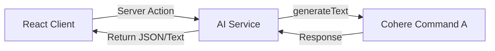

# AI Integration with Server Actions

How Neuro Cart uses the Vercel AI SDK and Cohere to power intelligent features across the platform using Next.js Server Actions.

## Stack

| Layer    | Technology                              |
| :------- | :-------------------------------------- |
| SDK      | `ai` (Vercel AI SDK v6)                 |
| Provider | `@ai-sdk/cohere` (Command A)            |
| Runtime  | Next.js Server Actions (`"use server"`) |

## Architecture

Unlike traditional setups that use API routes, Neuro Cart uses Server Actions for AI operations. This allows for direct calls from Client Components while maintaining server-side security for API keys.



## AI Service Location

The AI logic is organized by app in `app/actions/ai.ts`:

- `apps/store/app/actions/ai.ts`
- `apps/seller/app/actions/ai.ts`
- `apps/admin/app/actions/ai.ts`

## Key Implementation Patterns

### 1. Structured Output with category inference

Used in the Store for smart search:

```typescript
export async function searchProducts(query: string) {
  const { text } = await generateText({
    model: cohere("command-a-03-2025"),
    prompt: `Based on the user query: "${query}", identify the most relevant product category and keywords...`,
  });
  // Parse and return results
}
```

### 2. Multi-step Content Analysis

Used in the Admin dashboard for moderation:

```typescript
export async function analyzeContent(
  content: string,
  contentType: "product" | "review",
) {
  const { text } = await generateText({
    model: cohere("command-a-03-2025"),
    prompt: `Analyze the following ${contentType} for policy violations...`,
  });
  return JSON.parse(text);
}
```

## Available AI Features

| Dashboard  | Features                                                                      |
| :--------- | :---------------------------------------------------------------------------- |
| **Store**  | Smart search, product recommendations, listing summarization                  |
| **Seller** | AI product copy generation, SEO tag generation, sales pattern analysis        |
| **Admin**  | Automated content moderation, platform-wide insights, fraud pattern detection |

## Customizing Prompts

To adjust the AI behavior, modify the prompt strings inside the corresponding `ai.ts` file for the specific feature.
