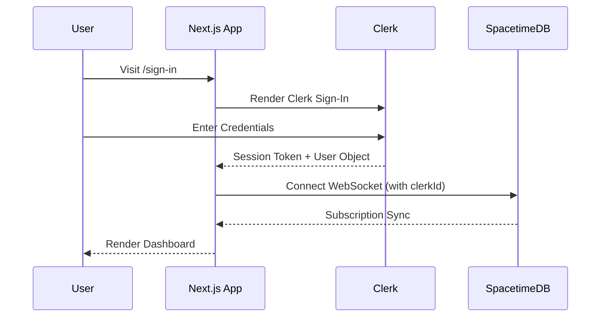

# Clerk Authentication Setup

How to configure Clerk for all three Neuro Cart dashboards.

## Create a Clerk Application

1. Go to [clerk.com](https://clerk.com) and sign in
1. Click **Add application**
1. Name it `Neuro Cart`
1. Enable **Email** and **Google** sign-in methods
1. Copy the **Publishable Key** and **Secret Key**

## Configure Environment

Add the keys to each app's `.env.local`:

```env
NEXT_PUBLIC_CLERK_PUBLISHABLE_KEY=pk_test_...
CLERK_SECRET_KEY=sk_test_...
NEXT_PUBLIC_CLERK_SIGN_IN_URL=/sign-in
NEXT_PUBLIC_CLERK_SIGN_UP_URL=/sign-up
```

## How Authentication Works



## Middleware (Proxy)

Each app uses a `proxy.ts` file to protect routes. Clerk's middleware intercepts requests before they reach the page:

```
apps/store/proxy.ts
apps/seller/proxy.ts
apps/admin/proxy.ts
```

Public routes (sign-in, sign-up) are excluded from protection. All other routes require an active Clerk session.

## User Sync with SpacetimeDB

When a user signs in through Clerk, their `clerkId` is used to connect to SpacetimeDB. The `useUserProfiles(clerkId)` hook finds or creates the matching `UserProfile` record in the user-server module.

## Role-Based Access

| Role   | Dashboard | Description                              |
| :----- | :-------- | :--------------------------------------- |
| Buyer  | Store     | Browse, cart, checkout, reviews          |
| Seller | Seller    | Product management, orders, analytics    |
| Admin  | Admin     | Platform oversight, moderation, AI tools |

Roles are stored in the `UserProfile.role` field as a `UserRole` enum (Buyer, Seller, Admin).
