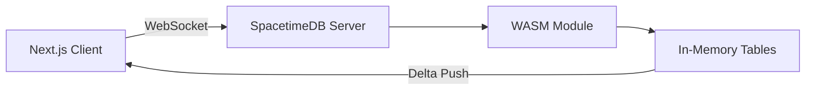

# SpacetimeDB Integration

How Neuro Cart uses 6 SpacetimeDB microservices for real-time data synchronization.

## Prerequisites

1. Install the Rust toolchain: [rustup.rs](https://rustup.rs)
2. Add the WASM target: `rustup target add wasm32-unknown-unknown`
3. Install the SpacetimeDB CLI:

```sh
curl -sSf https://install.spacetimedb.com | sh
```

## How It Works

SpacetimeDB compiles Rust structs into WASM modules. Clients connect via WebSockets and subscribe to table changes. When a reducer mutates state, all subscribed clients receive the delta instantly.



## Microservices

Neuro Cart uses 6 independent SpacetimeDB modules instead of one monolith:

| Server           | Tables                     | Purpose                     |
| :--------------- | :------------------------- | :-------------------------- |
| `product-server` | Product, Category          | Catalog management          |
| `cart-server`    | CartItem, WishlistItem     | Shopping cart and wishlists |
| `order-server`   | Order, OrderItem           | Order processing            |
| `user-server`    | UserProfile, SellerProfile | User and seller accounts    |
| `review-server`  | Review                     | Product ratings and reviews |
| `payment-server` | Payment                    | Payment records             |

## Deploy All Modules

```sh
spacetime start

spacetime publish -s local neuro-cart-products   --project-path servers/product-server
spacetime publish -s local neuro-cart-cart        --project-path servers/cart-server
spacetime publish -s local neuro-cart-orders      --project-path servers/order-server
spacetime publish -s local neuro-cart-users       --project-path servers/user-server
spacetime publish -s local neuro-cart-reviews     --project-path servers/review-server
spacetime publish -s local neuro-cart-payments    --project-path servers/payment-server
```

## Generate TypeScript Bindings

After publishing, generate client bindings:

```sh
spacetime generate -l typescript -o packages/shared/src/bindings/product-server -s local neuro-cart-products
spacetime generate -l typescript -o packages/shared/src/bindings/cart-server    -s local neuro-cart-cart
spacetime generate -l typescript -o packages/shared/src/bindings/order-server   -s local neuro-cart-orders
spacetime generate -l typescript -o packages/shared/src/bindings/user-server    -s local neuro-cart-users
spacetime generate -l typescript -o packages/shared/src/bindings/review-server  -s local neuro-cart-reviews
spacetime generate -l typescript -o packages/shared/src/bindings/payment-server -s local neuro-cart-payments
```

## Client Connection

The `@neuro-cart/shared` package provides 6 connection providers:

```tsx
import {
  ProductDbProvider,
  CartDbProvider,
  OrderDbProvider,
  UserDbProvider,
  ReviewDbProvider,
  PaymentDbProvider,
} from "@neuro-cart/shared/providers";
```

Each provider wraps the app in `Providers.tsx` and manages its own WebSocket connection.

## Available Hooks

| Hook                            | Description                           |
| :------------------------------ | :------------------------------------ |
| `useProducts()`                 | Products, categories, CRUD operations |
| `useCart(userId)`               | Cart items, wishlist items            |
| `useOrders(userId, sellerId)`   | Orders + order items                  |
| `useUserProfiles(clerkId)`      | User and seller profiles              |
| `useReviews(productId, userId)` | Product reviews                       |
| `usePayments(userId)`           | Payment records                       |

## Reducers

Reducers are the equivalent of API endpoints. They run server-side as WASM functions:

| Server         | Reducers                                                                                                    |
| :------------- | :---------------------------------------------------------------------------------------------------------- |
| product-server | `addProduct`, `updateProduct`, `deleteProduct`, `addCategory`, `deleteCategory`, `updateProductStock`       |
| cart-server    | `addToCart`, `removeFromCart`, `updateCartQuantity`, `clearUserCart`, `addToWishlist`, `removeFromWishlist` |
| order-server   | `createOrder`, `addOrderItem`, `updateOrderStatus`, `cancelOrder`                                           |
| user-server    | `createUser`, `updateUser`, `updateUserStatus`, `createSeller`, `updateSeller`                              |
| review-server  | `addReview`, `updateReview`, `deleteReview`, `markReviewHelpful`                                            |
| payment-server | `createPayment`, `updatePaymentStatus`                                                                      |
